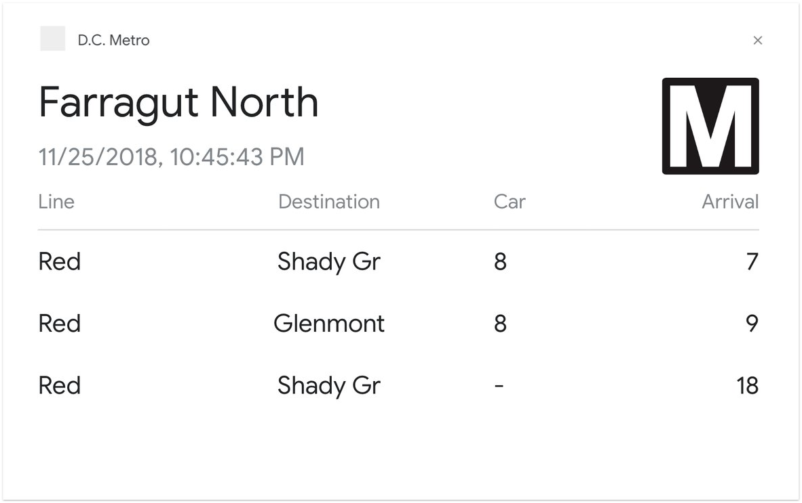

# DC Metro Google Action 🚉 🔉
This is a custom action for the Google Assistant which will tell you the current rail and bus predictions for the DC Metro transit system. These actions can be invoked on anything that supports Google Assistant such as a phone, a Google Home device, and the from the app.

## Installation Steps 💽
This application can be installed with npm by running `npm install` from within the [functions](/functions) directory. With the dependencies installed you can compile, lint and format the code base using the the following commands.

| Command | Description |
| ------------- | ------------- |
| `npm run format` | Formats the code. |
| `npm run lint` | Lints the code. |
| `npm run test` | Runs the unit tests. |

---

### Deploying
This project can be deployed to Firebase by running the `firebase deploy` command and by importing the DialogFlow intents using the zip file found in the root of the repository. You'll also need to setup an environment variable within your functions configuration called `metro.apiKey` with an API key from WMATA.

## Interactions 💬
You're able to invoke the application using Google Assistant by saying `Hey Google, talk to DC Metro`. Once the connection has been established you're able to ask it a series of questions.

| Action | Description |
| ------------- | ------------- |
| `Train Timetable`  | You can ask the action for a rail or train timetable at a specific station. For instance you can say `Rail timetable for Farragut North` or `Train timetable for U Street`. Stations with acronyms in their name will also work, for example `Train timetable for George Mason University`. |
| `Bus Timetable`  | You can ask the action for a bus stop timetable for a specific stop id. For instance you can say `Bus timetable for stop 123`. You can find the stop id on the sign that the bus stops at. |
| `Commands`  | You can ask the action for a list of available commands by saying either `train commands` or `bus commands`.  |

